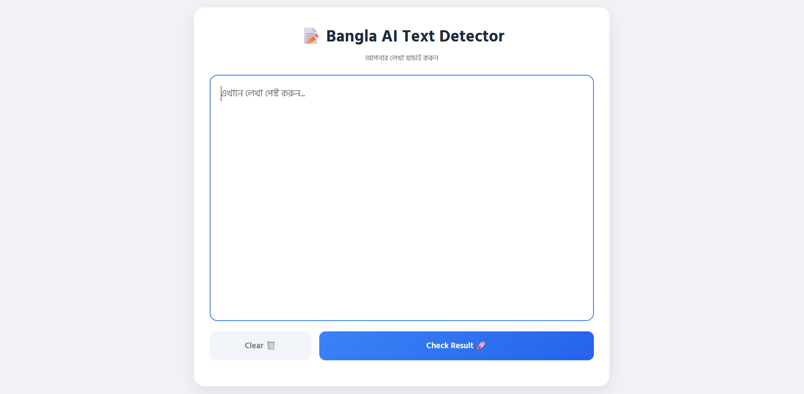

# 📝 Bangla AI Text Detector

A high-performance deep learning application designed to distinguish between human-written and AI-generated (e.g., ChatGPT, GPT-4) Bengali text. This project utilizes a fine-tuned **BanglaBERT** model to capture the nuances of Bengali syntax and semantics.

## 🚀 Live Demo
Access the live application here:  
**[👉 Live on Hugging Face Spaces](https://mee0011-bangla-ai-detector.hf.space/)**

---

## 📸 Interface Preview
<p align="center">
  
  <br>
  <i>Figure 1: Modern UI featuring a circular confidence meter for real-time results.</i>
</p>

---

## ✨ Features
- **Accurate Detection:** Powered by a fine-tuned BanglaBERT model for state-of-the-art NLP performance.
- **Dynamic Visualization:** A custom-built SVG circular progress bar provides intuitive visual feedback on detection confidence.
- **Clean UI/UX:** A minimalist, responsive design built with HTML5 and CSS3.
- **Fast Inference:** Backend powered by Flask for real-time prediction handling.
- **Scalable Deployment:** Fully containerized using **Docker** for consistent performance across environments.

## 🛠 Technical Stack
- **Core Model:** [BanglaBERT](https://huggingface.co/csebuetnlp/banglabert) (Fine-tuned)
- **Frameworks:** PyTorch, Transformers
- **Backend:** Flask (Python)
- **Frontend:** JavaScript (Vanilla), CSS3, HTML5
- **Environment:** Docker, Git LFS (Large File Storage)

## 📂 Project Structure
```text
├── app.py              # Flask Backend API
├── Dockerfile          # Container Configuration
├── requirements.txt    # Python Dependencies
├── screenshot.png      # Application Screenshot
├── templates/
│   └── index.html      # Modern Dashboard Interface
└── model/              # Fine-tuned Model Weights (LFS Tracked)
    ├── config.json
    ├── model.safetensors
    └── tokenizer.json
